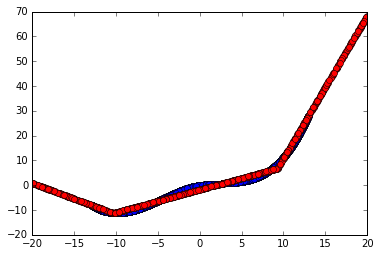
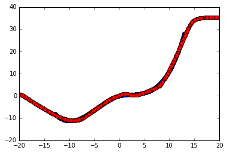

# Testing activation structures
Testing different activation structures/"functions" in neural networks. Obviously, structures like Maxout should be called activation structures, rather than activation functions. This was my old code, "work-in-progress", I wrote using Caffe. It seemed to prove that you can get much MUCH better results, actually, just awesome results, with 2 consecutive grouped layers with PReLU/ELU activations and can relatively easlily approximate non-convex functions vs what seems to be possible via 2 Maxout layers.

You'll likely need to change some paths to files. This is not intended for too broad an audience, if any. =)

Blue dots are from the underlying function, red dots are from the approximation learnt by NN. Maxout seemed harder to choose hyperparameters for, worked in a narrower range of LR, as far as I recall. Approximating y=f(x) with y and x having a single dimension.

2 Maxout layers. 1 neuron ->

(Maxout) Widening followed my a grouped reduction via Max operation ->

(Minout) grouped reduction via Min (or first [NEURONS * (-1)] and then Max) operation down to a single neuron ->

1 neuron ->

Result

[PReLU, or ELU, PELU, etc] followed by one of [ELU, Softmax, Sigmoid, TanH, etc. PReLU works even better if you want to get a more linear relationship outside of learning bounds].

1 neuron ->

N  (N >=1 )  neurons with PReLU. Then split into several groups. Neurons are connected inside these groups to a single neuron. Same as what happens inside Maxout. These resulting neurons approximate a convex function ->

M  (M*2 <= N)  neurons that recieve a convex function from the previous layer. Followed by [ELU, Softmax, Sigmoid, TanH, etc]. Same kind of connection to 1 neuron is done in this layer, this time, in this case when I'm testing only a single output dimention, there's no grouping, all are connected to just one --- pre-last --- neuron. Thereby, reversing the convex functions and combining them to achieve a non-convex one ->

1 neuron ->

Result. The previous layer couldn't be the last one, because the required result may have been negative, while our activation function was probably not. That's why there may have been a place for a bias. Scaling via weight is probably not important and likely is only hurting the learning process, but whatever..

PReLU followed by SoftMax architecture was inspired by Bezier curves https://www.jasondavies.com/animated-bezier/ and seemed to perform same as PReLU followed by ELU. I think I did later find some article published by other people who tried something very very similar having different much less exciting inspiration, but can't find it at the moment.

While in Maxout, especially with a larger multiplication factor, some neurons may get completely lost (at least, without an appropriate dropout - right before Max operation), in this architecture this is not possible.

If you'll discover some even better architectures, please, tell. (>‿◠)✌ I think Bezier curves should be a major inspiration for good non-convex activation structures.

All started from PReLU-PReLU architecture inspired by Maxout and PReLUs. Mind that all of these take more flops to compute than pure Maxout-Minout.
